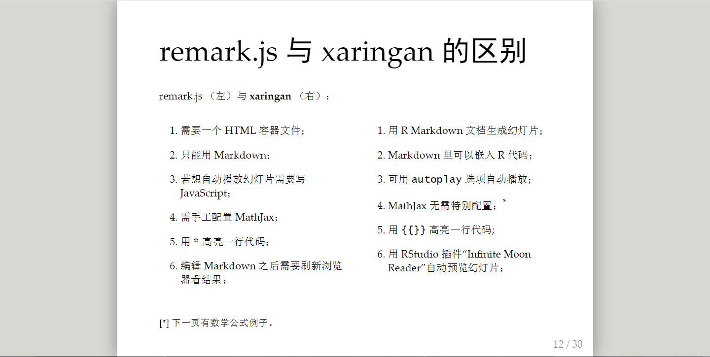

## 目录

- 自我介绍


- 用R制作PPT的几种方式

- R学习资源网站

- 政府遇上互联网复习

## 自我介绍
<p><span style="text-align:right;">
姓名: 黄贝贝

出生日期：2000-01

性别：女

民族： 汉
</span>
</p>
{height=200 width=150}


## 兴趣爱好{data-background=#963560}
- 绘画
- 骑行
- 听音乐


## 故乡
乌鲁木齐，通称乌市，旧称迪化，是新疆维吾尔自治区首府，国务院批复确定的中国西北地区重要的中心城市和面向中亚西亚的国际商贸中心。截至2018年，全市下辖7个区、1个县，总面积14216.3平方千米，建成区面积436平方千米，常住人口350.58万人，城镇人口261.57万人，城镇化率74.61%。

{height=200 width=500}


## 用R制作PPT的几种方式
1. R presentation
2. Rmarkdown
3. packages

## R presentation
格式：Rpres

```{r markdown table}
list1<-c("建立方式快捷","语法简单","YAML中支持代码插入")
list2<-c("对R chunk的支持不如rmarkdown","不会自动knitHTML","NULL")
tab<-data.frame('优点' = list1,'缺点' = list2)
knitr::kable(tab,format = "markdown",caption = "pie函数")
```

## Rmarkdown--ioslides
|优点|缺点|
|----|----|
|knit的速度快|支持的自定义样式少|
||换页方式单一|

## Rmarkdown--slidy
|优点|缺点|
|----|----|
|自定义方式比ioslides灵活|knit速度慢|
|提供多种主题||

## Rmarkdown--Beamer
Beamer是（LaTeX ）类，用于生成演示文稿和幻灯片。在学术界很常见，添加数学公式和表达式也很有用。您可以从R创建自己的Beamer演示文稿，而无需深入了解LaTeX 。
Beamer转换pdf很方便

## packages--reveal.js
<center>本文档使用reveal.js包制作</center>
|优点|缺点|
|----|----|
|换页方式多|对CSS支持不好，很多标签无法显示|
|自定义方式多，省去CSS||
|字体自动居中||

## packages--xaringan
本程序包由谢益辉制作，融合了reveal.js和rmd的优点
下图为xaringanPPT页面


{height=300 width=500}

## packages--xaringan
优点

- 语法简单，结合了rmd和rpres

- 页面美观

- 插图方便

- 排版简单

缺点

- 文件需要联网，knit速度慢

## R学习资源网站{data-background=#963560}
教程类

-[W3Cschool](https://www.w3cschool.cn/r/)

- [bookdown](https://www.bookdown.org/)

- [清华大学的R教程](http://www.math.pku.edu.cn/teachers/lidf/docs/Rbook/html/_Rbook/index.html)
- [Rstudio说明](https://rstudio.com)


## 实操类{data-background-iframe="https://rstudio.cloud/"}
- [菜鸟教程-R在线工具](https://c.runoob.com/compile/5649)
- [Rstudio cloud](https://rstudio.cloud/)

## 问答类
- [stackoverflow](https://stackoverflow.com/)
- [kaggle](https://www.kaggle.com/)

## 用R制作几种简单图形{data-background=#963560}

- 放射图
- 饼图


## 放射图
- 用read.table/read.csv读取文件

    > ```do<-read.table("number.txt",header=FALSE,sep="")```

- 用networkD3包的simpleNetwork生成放射图

    > ```simpleNetwork(do)```

## 示例
```{r number}
do<-read.table("number.txt",header = FALSE,sep = "")
library(networkD3)
simpleNetwork(do,linkColour = "#ff99ff",nodeColour = '#000000',zoom = TRUE,height = 420,width=560,fontSize = 15)
```

## 饼图
了解pie函数

```pie(x, labels = names(x), radius = 0.8,main= “NULL”, col = NULL, clockwise = FALSE,
density = NULL, angle = 45, lty = NULL, border = NULL, edges = 200, ….)```


## 饼图参数
各参数的内容
```{r markdodown table}
list1<-c("x","labels","radius","main","col")
list2<-c("每个扇形的面积","每个扇形名称","饼图圆的半径","饼图的标题","每个扇形的颜色")
tab<-data.frame('参数' = list1,'含义' = list2)
knitr::kable(tab,format = "markdown",caption = "pie函数")
```


## 饼图示例
```{r pie chart}
x <- c(10,20,30,40,50)
label <- c("A","B", "C", "D", "E")
pie(x,labels=label,main="example",col = rainbow(length(x)))
```

## 政府遇上互联网{data-background=#963560}
- 信息简史
- 信息政策
- 信息化与政府效能

## 阅读参考
1.中国国家治理的特点及网络治理的特点

-  基础性治理
-  介入性治理
-  渗透性治理

## 2.国家的大数据发展战略及未来
- 大数据发展的影响

		- 效果性影响
		- 范式性影响

			- 政治

				- 选举动员的方式会发生革命性的变化

			- 经济

				- 成为一个新兴的重要产业，并对其他产业形成新支撑


## 3.云计算战略对公共领域的影响
- 云计算对于公共领域的效果性影响

		- 弹性使用信息资源，节省行政成本
		- 推动政府过程透明化和信息公开
		- 推动公共服务智慧化和人性化
		- 在纵向上进一步整合公共服务，这更有利于推动公共服务一体化和均等化
		- 在横向上进一步整合公共服务，这更有利于实现无缝隙政府
	
##4.云计算战略对国际领域的影响
- 云计算对军事领域的影响

		- 提高行政效率
		- 提高信息化作战能力
		- 提高军队信息处理能力

	- 云计算对国际关系的影响

		- 推进多极化趋势发展
		- 对国际关系中行为体的力量对比产生一定影响
		- 建立国际信息体制
		
## 5.网络空间发展中公共治理的转变

- 公共领域与网络空间的出现

		
	- 网络空间的膨胀与公共治理

		

	- 网络空间倒逼政府转型

		


	- 网络空间倒逼的公共安全方案
	
## 6.网络空间发展中的公共舆论治理
- 中国政府回应网络舆论的对策

		- 科学建立网络舆论回应机制
		- 强化网络舆论治理的体系与制度建设
		- 提升各级政府官员回应网络的能力与素养
		
## 7.网络空间发展中的公共风险治理
- 服务性
- 时效性
- 开放性
- 共享性

##谢谢观看{data-background=#963560}
Thank you for watching!


